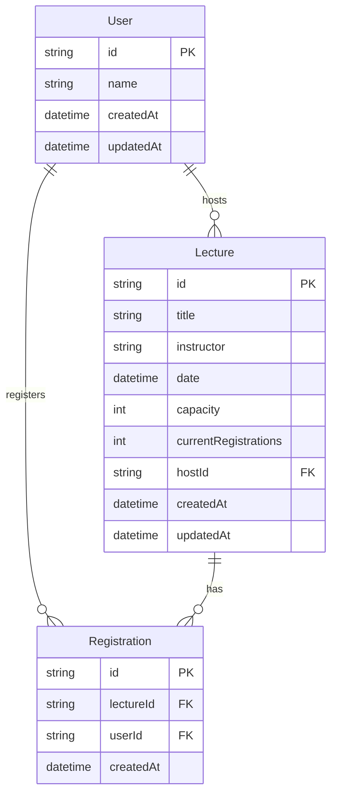

## 아키텍처 준수를 위한 애플리케이션 패키지 설계

아키텍처 준수를 위한 애플리케이션 패키지 설계는 아키텍처 원칙을 실제 코드 구조에 반영하는 과정입니다.

이는 지속적으로 성장 가능한 서버를 만들기 위한 가이드라인을 코드 레벨에서 구현하는 것을 의미합니다.

좋은 패키지 설계의 핵심은 '상위 계층에서 하위 계층으로의 일관된 단방향 흐름'을 한 눈에 파악할 수 있도록 하는 것입니다.

이러한 설계는 '의존성을 명확히 관리하고 변경의 영향을 제한'할 수 있기 때문에 유지보수성과 확장성을 높일 수 있습니다.

아래 이미지는 이러한 원칙을 반영한 완성된 애플리케이션 패키지 설계의 결과입니다.


이 설계에서는 각 계층이 명확히 구분되어 있으며, 의존성의 방향이 일관되게 유지되고 있습니다. 이를 통해 코드의 구조를 직관적으로 이해할 수 있고, 변경 사항이 발생했을 때 그 영향을 최소화할 수 있습니다.

```bash
lecture-registration-system/src
│
├── app.module.ts
├── main.ts
│
├── application/
│   ├── application.module.ts
│   ├── components/
│   │   ├── index.ts
│   │   ├── lecture.manager.component.ts
│   │   └── registration.manager.component.ts
│   ├── exceptions/
│   │   ├── application.exception.ts
│   │   ├── index.ts
│   │   ├── lecture-full.exception.ts
│   │   ├── lecture-not-found.exception.ts
│   │   ├── registration-fail.exception.ts
│   │   └── user-already-registered.exception.ts
│   └── services/
│       ├── index.ts
│       └── lecture.service.ts
│
├── common/
│   ├── config/
│   │   └── path.ts
│   └── error/
│       ├── error.code.ts
│       └── index.ts
│
├── domain/
│   └── value-objects/
│       ├── available-lecture.vo.ts
│       ├── index.ts
│       ├── lecture.vo.ts
│       ├── registered-lecture.vo.ts
│       ├── registration.vo.ts
│       └── user.vo.ts
│
├── infrastructure/
│   ├── infrastructure.module.ts
│   └── prisma/
│       ├── migrations/
│       │   └── ... (migration files)
│       ├── prisma.service.ts
│       └── schema.prisma
│
└── presentation/
    ├── controllers/
    │   ├── app.controller.ts
    │   ├── index.ts
    │   └── lecture.controller.ts
    ├── filters/
    │   ├── global.exception.filter.ts
    │   └── index.ts
    └── presentation.module.ts
```

## 특강 신청 서비스 ERD 및 설계 설명

### ERD (Entity Relationship Diagram)



### 설계 이유 설명

1. **User 모델**:
   - 사용자 정보를 저장합니다.
   - `id`를 기본 키로 사용하여 각 사용자를 고유하게 식별합니다.
   - `name` 필드로 사용자 이름을 저장합니다.
   - `createdAt`과 `updatedAt` 필드로 생성 및 수정 시간을 추적합니다.

2. **Lecture 모델**:
   - 특강 정보를 저장합니다.
   - `id`를 기본 키로 사용하여 각 특강을 고유하게 식별합니다.
   - `title`, `instructor`, `date` 필드로 특강의 기본 정보를 저장합니다.
   - `capacity`는 특강의 최대 수용 인원을 나타내며, 기본값은 30으로 설정됩니다.
   - `currentRegistrations`는 현재 등록된 인원 수를 추적합니다.
   - `hostId`는 특강을 주최하는 User와의 관계를 나타냅니다.
   - `currentRegistrations`에 인덱스를 추가하여 빠른 조회가 가능하도록 합니다.
   - `date`에 인덱스를 추가하여 날짜별 조회 성능을 향상시킵니다.

3. **Registration 모델**:
   - 사용자의 특강 등록 정보를 저장합니다.
   - `id`를 기본 키로 사용하여 각 등록을 고유하게 식별합니다.
   - `lectureId`와 `userId`로 어떤 사용자가 어떤 특강에 등록했는지 나타냅니다.
   - `userId`와 `lectureId`의 조합에 유니크 제약 조건을 추가하여 동일 사용자가 같은 특강에 중복 등록하는 것을 방지합니다.
   - `lectureId`와 `userId`에 복합 인덱스를 추가하여 조회 성능을 향상시킵니다.

이 설계는 다음과 같은 이점을 제공합니다.
- 사용자, 특강, 등록 정보를 명확하게 분리하여 관리할 수 있습니다.
- 특강의 수용 인원과 현재 등록 인원을 쉽게 추적할 수 있습니다.
- 인덱스를 적절히 사용하여 조회 성능을 최적화했습니다.
- 중복 등록을 방지하는 제약 조건을 추가하여 데이터 무결성을 보장합니다.

#### `currentRegistrations` 필드 사용에 대한 고민점
  1. 쿼리 효율성:
    - 이 필드를 사용함으로써 특강의 현재 등록 인원을 확인하기 위해 매번 Registration 테이블을 카운트하는 비용이 큰 쿼리를 실행할 필요가 없어집니다.
    - 특히 선착순 등록과 같은 상황에서 등록 가능 여부를 빠르게 확인할 수 있어 성능상 이점이 큽니다.
  2. `currentRegistrations`는 Registration 테이블의 실제 등록 수와 불일치할 가능성이 있는 중복 데이터입니다.
    - 이를 관리하기 위해서 트랜잭션 내에서 Registration 생성/삭제와 함께 필드를 업데이트 했습니다.

## 각 기능에 대한 단위 테스트 결과

### LectureManager
```bash
PASS  test/unit/application/components/lecture.manager.spec.ts
 LectureManager
   checkLectureExists
     ✓ 강의를 찾았을 때 아무 일도 일어나지 않아야 함 (9 ms)
     ✓ 강의를 찾지 못했을 때 LectureNotFoundException을 발생시켜야 함 (7 ms)
   findAvailableLectures
     ✓ 특정 날짜의 이용 가능한 강의만 올바르게 반환해야 함 (2 ms)
     ✓ 이용 가능한 강의가 없을 때 빈 배열을 반환해야 함 (1 ms)

Test Suites: 1 passed, 1 total
Tests:       4 passed, 4 total
Snapshots:   0 total
Time:        3.044 s
```

### RegistrationManager
```bash
PASS  test/unit/application/components/registration.manager.spec.ts
 RegistrationManager
   checkRegistrationAvailability
     ✓ 강의 정원이 꽉 찼을 때 LectureFullException을 발생시켜야 함 (15 ms)
     ✓ 사용자가 이미 등록되어 있을 때 UserAlreadyRegisteredException을 발생시켜야 함 (2 ms)
     ✓ 강의 정원에 여유가 있고 사용자가 등록되지 않았을 때 예외가 발생하지 않아야 함 (2 ms)
   register
     ✓ 강의 등록이 성공적으로 이루어져야 함 (2 ms)
   findRegistrationsBy
     ✓ 사용자의 등록된 강의 목록을 올바르게 반환해야 함 (2 ms)
     ✓ 등록된 강의가 없을 때 빈 배열을 반환해야 함 (2 ms)

Test Suites: 1 passed, 1 total
Tests:       6 passed, 6 total
Snapshots:   0 total
Time:        3.078 s
```

### LectureService
```bash
PASS  test/unit/application/lecture.service.spec.ts
 LectureService
   registerForLecture
     ✓ 사용자를 강의에 성공적으로 등록해야 함 (10 ms)
   findAvailableLectures
     ✓ 주어진 날짜에 대해 이용 가능한 강의를 반환해야 함 (4 ms)
   getUserRegistrations
     ✓ 사용자가 등록한 강의 목록을 반환해야 함 (2 ms)

Test Suites: 1 passed, 1 total
Tests:       3 passed, 3 total
Snapshots:   0 total
Time:        3.135 s
```

## STEP 3 & 4 통합 테스트 결과
